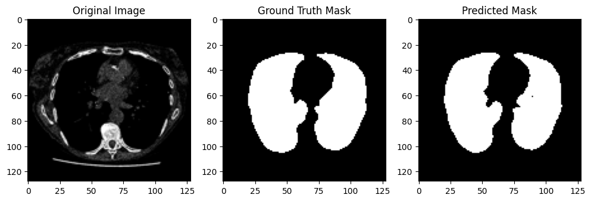

# 🧠 Medical Image Segmentation using U-Net (CT Scans)

## 📌 Overview
This project focuses on building a deep learning-based medical image segmentation model using the U-Net architecture to segment regions of interest from CT scan images.

The goal is to develop an accurate and efficient pipeline for medical image analysis, which can assist in clinical diagnosis and reduce manual workload.

---

## 🎯 Objectives
- Perform segmentation on CT scan images
- Build and train a U-Net model
- Evaluate performance using medical imaging metrics
- Understand preprocessing and handling of medical imaging data

---

## 🧾 Dataset
- Dataset consists of CT scan images and corresponding segmentation masks
- Images are preprocessed for:
  - Resizing
  - Normalization
  - Noise reduction
- (Optional) Can be extended to DICOM format using `pydicom`

---

## 🧠 Model Architecture

### U-Net
- Encoder-Decoder architecture
- Skip connections for spatial information preservation
- Effective for biomedical image segmentation

#### Key Components:
- Convolutional layers
- MaxPooling (Encoder)
- UpSampling (Decoder)
- Skip connections

---

## ⚙️ Tech Stack
- Python
- TensorFlow / Keras (or PyTorch if applicable)
- NumPy, OpenCV
- Matplotlib (visualization)

---

## 🔄 Workflow

### 1. Data Preprocessing
- Load images and masks
- Resize to fixed dimensions
- Normalize pixel values
- Split into train/test sets

### 2. Model Training
- U-Net architecture implementation
- Loss function: Binary Crossentropy / Dice Loss
- Optimizer: Adam
- Training over multiple epochs

### 3. Evaluation
- Metrics used:
  - Dice Score
  - Intersection over Union (IoU)

### 4. Visualization
- Predicted masks vs ground truth
- Overlay segmentation results

---

## 📊 Results
- Achieved meaningful segmentation on CT scan images
- Model demonstrates capability to identify regions of interest
- Performance evaluated using Dice Score and IoU

---

## 📷 Sample Output

---

## 🚀 How to Run

### 1. Clone Repository
```bash
git clone https://github.com/gnikhilchand/Image_Segmentation
cd Image_Segmentation
```
### 2. Install Dependencies
```bash
pip install -r requirements.txt
```
### 3. Run Notebook / Script
```bash
jupyter notebook Image_Segmentation.ipynb
```

## 🧠 Key Learnings
- Understanding of medical image segmentation
- Implementation of U-Net architecture
- Importance of preprocessing in medical imaging
- Evaluation using domain-specific metrics (Dice, IoU)
   
